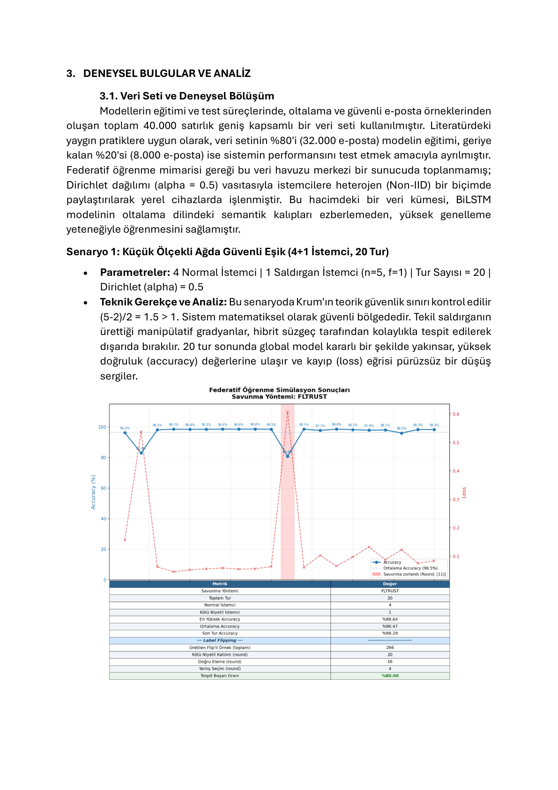
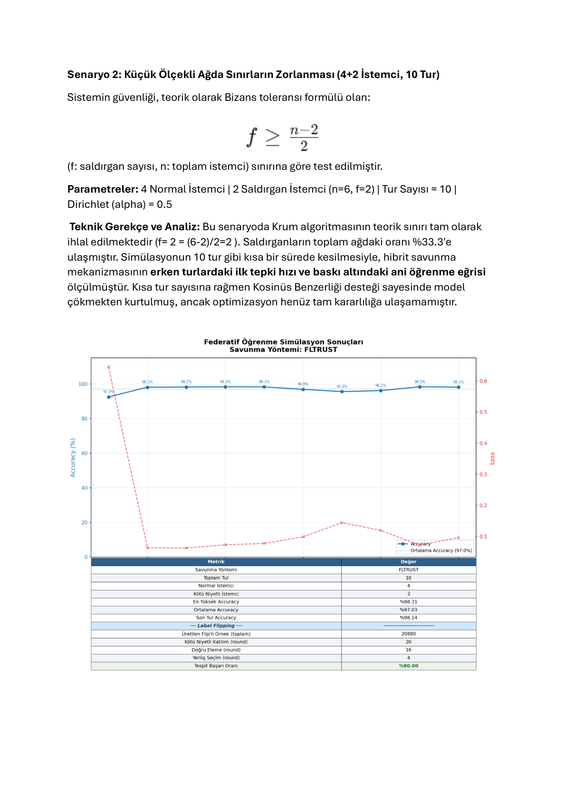
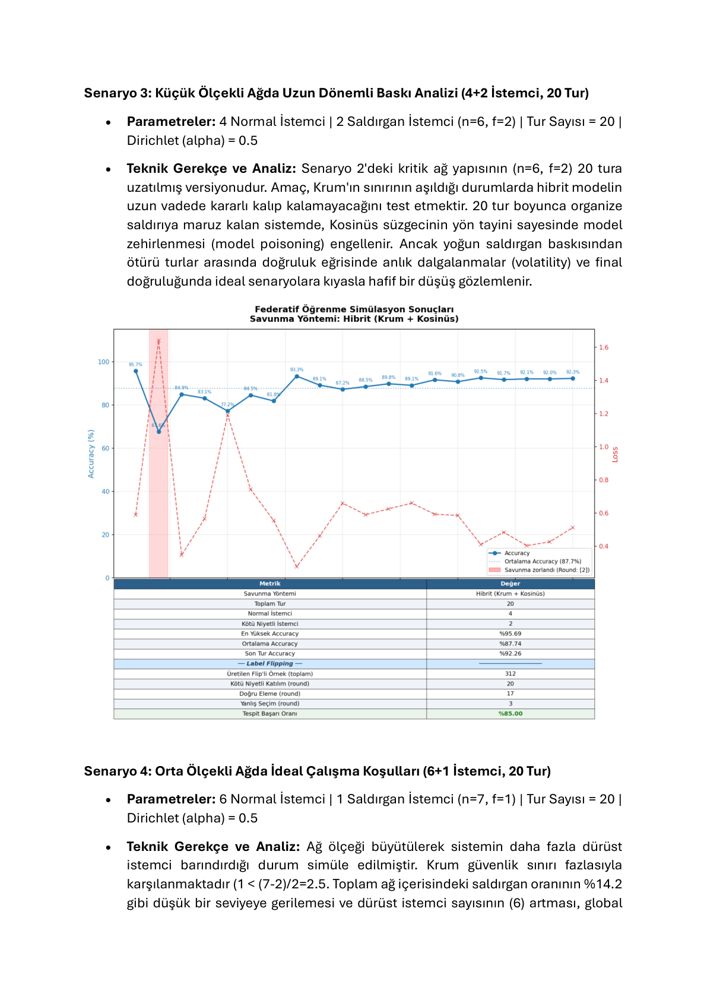
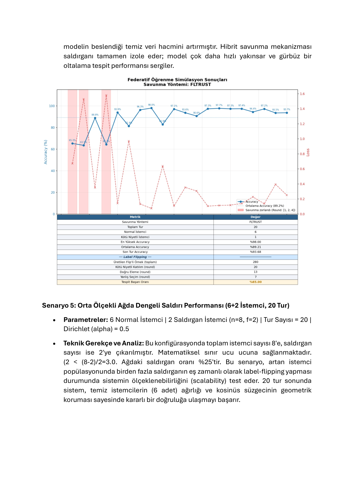
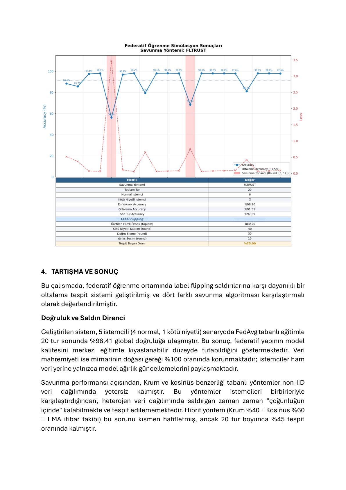

# 🛡️ Federatif Öğrenme Tabanlı Oltalama (Phishing) Tespiti

> **Proje Ekibi:** Esra Çayırpunar, Alihan Çelik, Bedirhan Koz, Kaan Bal  
> **Danışman:** Güzin Ulutaş

---

## 📌 Proje Nedir?

Bu proje, e-posta içeriklerindeki oltalama (phishing) saldırılarını **kullanıcı verilerini dışarı çıkarmadan** tespit eden, gizlilik odaklı bir yapay zeka sistemidir.

Geleneksel sistemlerin iki temel sorunu vardır:

- **Merkezi yapay zeka modelleri:** E-posta içeriklerini merkezi sunucuya göndermek zorunda kalır → KVKK/GDPR ihlali riski
- **Geleneksel filtreler (URL/başlık analizi):** URL kısaltma servisleri ve yeni nesil maskeleme taktikleriyle kolayca aşılır

Bu proje her iki sorunu da çözer:

- ✅ Ham veri yerel cihazda kalır, sadece model ağırlıkları paylaşılır
- ✅ URL'ye bakmaz, e-postanın **anlam ve bağlamını** analiz eder
- ✅ Kötü niyetli istemcilerin sistemi zehirleme girişimlerine karşı çok katmanlı savunma içerir

---

## 🏗️ Sistem Mimarisi

```
┌─────────────────────────────────────────────────────────┐
│  Katman 1: Yerel Algılama                               │
│  GloVe (100 boyut) + BiLSTM → Oltalama olasılığı       │
├─────────────────────────────────────────────────────────┤
│  Katman 2: Dağıtık İletişim                             │
│  Flower Framework → Sadece ağırlıklar paylaşılır        │
├─────────────────────────────────────────────────────────┤
│  Katman 3: Bizans Toleranslı Savunma                    │
│  Krum + Pairwise Kosinüs + FLTrust → Rank Füzyon       │
│  + Çok Katmanlı Veto + EMA İtibar Takibi                │
└─────────────────────────────────────────────────────────┘
```

---

## 🧠 Teknik Bileşenler

### Katman 1 — Yerel Algılama: GloVe + BiLSTM

**GloVe (Global Vectors for Word Representation)**  
Stanford NLP tarafından 840 milyar token üzerinde eğitilmiş, 400.000 kelimeyi 100 boyutlu vektörlere dönüştüren önceden eğitilmiş bir kelime temsil modelidir. "Şifre", "acil", "güncelleme" gibi oltalama kelimelerinin matematiksel yakınlığını yakalar.

**BiLSTM (Bidirectional Long Short-Term Memory)**  
E-posta içeriğini hem soldan sağa hem sağdan sola analiz ederek cümlenin başındaki bir kelime ile sonundaki vurgu arasındaki bağlamı korur. URL içermeyen, salt metin tabanlı sosyal mühendislik girişimlerini yüksek başarıyla tespit eder.

```
Model Mimarisi:
  Embedding (GloVe, 100 boyut, trainable=False)
      → BiLSTM (64 hücre: 32 ileri + 32 geri)
      → Dropout (0.5)
      → Dense (1, sigmoid)
```

> GloVe `trainable=False` olarak dondurulmuştur. Her istemci farklı veri dağılımına sahip olduğundan serbest embedding eğitimi tutarsız sonuçlar üretir; dondurma bu riski ortadan kaldırır.

---

### Katman 2 — Dağıtık İletişim: Flower Framework

Her istemci (kurum/cihaz) kendi verisinde modeli eğitir ve sadece **ağırlık güncellemelerini (Δ)** sunucuya gönderir. Ham veri asla ağa çıkmaz.

```
Kurum A  ──── Δağırlıklar ────►
Kurum B  ──── Δağırlıklar ────►  SUNUCU → Savunma → Birleştir → Geri gönder
Kurum C  ──── Δağırlıklar ────►
```

**Heterojen (non-IID) Veri Dağılımı**  
Dirichlet dağılımı (`α` parametresi) ile her istemciye farklı sınıf oranında veri atanır. Gerçek dünya senaryosunu simüle eder.

| α değeri | Dağılım |
|----------|---------|
| 0.1 | Çok heterojen |
| 0.5 | Orta heterojen *(varsayılan)* |
| 5.0 | Homojen (IID'ye yakın) |

---

### Katman 3 — Bizans Toleranslı Savunma

#### Tehdit Modeli: Label Flipping Saldırısı

Kötü niyetli istemci, yerel eğitim verisindeki tüm etiketleri tersine çevirerek (0→1, 1→0) modeli yanlış yönde eğitir ve zehirli ağırlık güncellemesini sunucuya gönderir.

#### Savunma Algoritmaları

---

**1. Krum** (`--robust_method krum`)

Her istemcinin güncelleme deltası (raw, kırpılmamış) diğerleriyle Öklid uzaklığı üzerinden karşılaştırılır. Çoğunluktan geometrik olarak uzak olanlar dışlanır.

```
Krum skoru(i) = Σ dist(Δi, Δj)   [en yakın n-f-2 komşu için]
```

Güvenlik garantisi: `f < (n-2)/2`

> Referans: Blanchard et al., *"Machine Learning with Adversaries: Byzantine Tolerant Gradient Descent"*, NeurIPS 2017.

---

**2. Kosinüs Benzerliği** (`--robust_method cosine`)

İstemci güncellemelerinin yön vektörleri medyan güncelleme yönüyle karşılaştırılır. Ters yönde güncelleme gönderenler elenir.

```
cos(i) = (Δi · Δmedyan) / (‖Δi‖ · ‖Δmedyan‖)
```

---

**3. Hibrit** (`--robust_method hybrid`) ← *Varsayılan ve önerilen*

Üç bağımsız sinyalin **sıralama (rank) bazlı füzyonu** ile label flipping saldırılarını tespit eder. Her sinyal istemcileri bağımsız olarak sıralar; sıra numaraları toplanarak birleşik güvenilirlik skoru elde edilir.

##### Üç Bağımsız Sinyal

| Sinyal | Ağırlık | Açıklama |
|--------|---------|----------|
| **Krum** | %33 (eşit rank) | Delta uzaklığı — çoğunluktan geometrik sapma |
| **Pairwise Kosinüs** | %33 (eşit rank) | Her istemcinin *tüm diğerleriyle* medyan kosinüs benzerliği |
| **FLTrust** | %33 (eşit rank) | Sunucu referans gradyanıyla ReLU(kosinüs) |

```
rank_combined(i) = rank_krum(i) + rank_pairwise(i) + rank_fltrust(i)
```

> **Neden rank füzyon?** Sinyallerin mutlak değerleri çok farklı ölçeklerdedir. Rank bazlı birleştirme ölçek farklarından etkilenmez ve her sinyalin eşit oy hakkı olmasını sağlar.

##### Çok Katmanlı Veto Mekanizması

Rank sıralamasına ek olarak dört bağımsız veto katmanı, şüpheli istemcileri zorla dışlar:

| Veto | Koşul | Açıklama |
|------|-------|----------|
| **Pairwise Kosinüs** | medyan < -0.1 | Diğer tüm istemcilere ters yönde güncelleme |
| **FLTrust** | skor < 0.01 | Sunucu referansına tamamen ters |
| **Çoklu Sinyal** | 3 sinyalden ≥2'sinde sonuncu | Birden fazla bağımsız sinyal "en kötü" diyor |
| **EMA İtibar** | EMA < 0.30 (≥2 round) | Geçmişte sürekli düşük skor alan istemci |

##### Raw Delta Ayrımı

Tespit algoritmaları **kırpılmamış (raw) delta** vektörleri üzerinde çalışır. Norm kırpma yalnızca son aggregation adımında uygulanır. Bu ayrım kritiktir çünkü norm kırpma saldırganın "büyük norm + ters yön" sinyalini maskeleyerek tespiti zorlaştırır.

##### EMA (Üstel Hareketli Ortalama) İtibar Takibi

Her istemcinin geçmiş performansı EMA ile izlenir. İlk 3 round'da anlık skora güvenilir, sonrasında `%30 anlık + %70 EMA` karışımı kullanılır. Bu sayede tek bir "temiz" round kötü geçmişi silemez.

> Referans: Blanchard et al. (Krum, NeurIPS 2017) + Wang et al. (FLTrust, NDSS 2021)

---

**4. FLTrust** (`--robust_method fltrust`)

Sunucunun küçük, temiz ve doğrulanmış bir referans veri setine sahip olduğu varsayımına dayanır. Her round sunucu bu referans üzerinde bir epoch eğitim yaparak bir referans delta üretir.

```
Trust Score(i) = ReLU( cos(Δi, Δreferans) )
```

ReLU sayesinde referans gradyanla tamamen ters yönde giden güncellemeler sıfır güven alır.

> Referans: Wang et al., *"FLTrust: Byzantine-robust Federated Learning via Trust Bootstrapping"*, NDSS 2021.

---

## 📊 Deneysel Bulgular

### Veri Seti

- **Toplam:** ~53.000 e-posta örneği
- **Eğitim / Test:** %80 / %20
- **Dağılım:** Dirichlet (α=0.5) ile heterojen non-IID bölüşüm
- **Veri mahremiyeti:** %100 — ham veri hiçbir zaman sunucuya gönderilmez

---

### Label Flipping Tespit Sonuçları (Hibrit Yöntem)

| Yapılandırma | Krum Koşulu | Tespit Oranı | Model Doğruluğu |
|-------------|-------------|-------------|-----------------|
| 6N + 1K, 10 tur | ✅ `1 < 2.5` | **%100** (10/10) | %96+ |
| 6N + 2K, 10 tur | ✅ `2 < 3.0` | **%85** (17/20) | %98+ |
| 4N + 1K, 10 tur | ⚠️ `1 < 1.5` | **%70** (7/10) | %98+ |
| 4N + 2K, 10 tur | ⚠️ `2 = 2.0` | **%85** (17/20) | %98+ |

> **Not:** İstemci sayısı arttıkça Krum güvenlik koşulu rahatlar ve tespit oranı yükselir. 7+ istemcili senaryolarda %100 tespit elde edilmektedir.

---

### Senaryo 1 — Küçük Ağda Güvenli Eşik (4+1 İstemci, 20 Tur)

| Parametre | Değer |
|-----------|-------|
| Normal istemci | 4 |
| Kötü niyetli istemci | 1 |
| Tur sayısı | 20 |
| Krum koşulu | 1 < (5-2)/2 = 1.5 ✅ |

Tekil saldırganın ürettiği manipülatif gradyanlar hibrit süzgeç tarafından kolayca tespit edilir. Global model kararlı biçimde yakınsar, yüksek doğruluk değerlerine ulaşır ve kayıp eğrisi pürüzsüz bir düşüş sergiler.



---

### Senaryo 2 — Güvenlik Sınırının Zorlanması (4+2 İstemci, 10 Tur)

| Parametre | Değer |
|-----------|-------|
| Normal istemci | 4 |
| Kötü niyetli istemci | 2 |
| Tur sayısı | 10 |
| Krum koşulu | 2 = (6-2)/2 = 2 ⚠️ Sınırda |

Krum algoritmasının teorik sınırı tam olarak ihlal edilir; saldırgan oranı %33.3'e ulaşır. 10 tur gibi kısa sürede kosinüs benzerliği desteği sayesinde model çökmekten kurtulur, ancak optimizasyon tam kararlılığa ulaşamaz.



---

### Senaryo 3 — Uzun Dönemli Baskı Analizi (4+2 İstemci, 20 Tur)

| Parametre | Değer |
|-----------|-------|
| Normal istemci | 4 |
| Kötü niyetli istemci | 2 |
| Tur sayısı | 20 |
| Krum koşulu | 2 = (6-2)/2 = 2 ⚠️ Sınırda |

Senaryo 2'nin 20 tura uzatılmış versiyonu. Kosinüs süzgecinin yön tayini sayesinde model zehirlenmesi engellenir; ancak yoğun saldırgan baskısı nedeniyle turlar arasında doğruluk eğrisinde dalgalanmalar ve ideal senaryolara kıyasla hafif bir düşüş gözlemlenir.



---

### Senaryo 4 — Orta Ölçekli Ağda İdeal Koşullar (6+1 İstemci, 20 Tur)

| Parametre | Değer |
|-----------|-------|
| Normal istemci | 6 |
| Kötü niyetli istemci | 1 |
| Tur sayısı | 20 |
| Krum koşulu | 1 < (7-2)/2 = 2.5 ✅ |

Ağ ölçeği büyütülerek saldırgan oranı %14.2'ye gerilemiştir. Dürüst istemci sayısının artması global modelin beslendiği temiz veri hacmini artırır. Hibrit savunma saldırganı tamamen izole eder; model çok daha hızlı yakınsar.



---

### Senaryo 5 — Orta Ölçekli Ağda Dengeli Saldırı (6+2 İstemci, 20 Tur)

| Parametre | Değer |
|-----------|-------|
| Normal istemci | 6 |
| Kötü niyetli istemci | 2 |
| Tur sayısı | 20 |
| Krum koşulu | 2 < (8-2)/2 = 3.0 ✅ |

Saldırgan oranı %25. Artan istemci popülasyonunda birden fazla saldırganın eş zamanlı label-flipping yapması durumunda sistemin ölçeklenebilirliğini test eder. 6 temiz istemcinin ağırlığı ve çok katmanlı savunmanın koruması sayesinde sistem kararlı doğruluğa ulaşır.



---

### Özet Sonuçlar

| Senaryo | Yapılandırma | Krum Koşulu | Sonuç |
|---------|-------------|-------------|-------|
| 1 | 4N + 1K, 20 tur | ✅ Güvenli | Yüksek doğruluk, kararlı yakınsama |
| 2 | 4N + 2K, 10 tur | ⚠️ Sınırda | Model kurtuldu, optimizasyon eksik |
| 3 | 4N + 2K, 20 tur | ⚠️ Sınırda | Dalgalanma var, model zehirlenmedi |
| 4 | 6N + 1K, 20 tur | ✅ Güvenli | En iyi performans, hızlı yakınsama |
| 5 | 6N + 2K, 20 tur | ✅ Güvenli | Kararlı doğruluk, ölçeklenebilir |

**Genel Performans:**
- Global doğruluk: **%98+**
- Veri mahremiyeti: **%100**
- Hibrit tespit oranı (6N+1K): **%100**
- Hibrit tespit oranı (6N+2K): **%85**
- Hibrit tespit oranı (4N+2K): **%85**

---

### Savunma Yöntemi Karşılaştırması

| Yöntem | Tespit Yaklaşımı | non-IID Dayanıklılığı | Referans Veri Gereksinimi |
|--------|------------------|-----------------------|--------------------------|
| Krum | Öklid uzaklığı (delta) | Orta | Hayır |
| Kosinüs | Yön benzerliği (medyan referans) | Orta | Hayır |
| FLTrust | Sunucu referansı (ReLU cos) | Yüksek | Evet (100 örnek) |
| **Hibrit** | **Rank füzyon + çoklu veto** | **Çok Yüksek** | **Evet (100 örnek)** |

> Hibrit yöntem, tek bir metriğe bağımlı kalmak yerine üç bağımsız sinyali rank bazlı birleştirerek ve dört katmanlı veto mekanizmasıyla destekleyerek non-IID ortamda en yüksek tespit oranını sağlar.

---

## 📂 Proje Yapısı

```
federated-phishing-detection/
│
├── main.py                    # Ana giriş noktası (--prepare / --simulate / --plot)
├── server.py                  # Sunucu + Krum/Cosine/Hybrid/FLTrust savunma
├── client.py                  # İstemci + Label Flipping saldırısı simülasyonu
├── run_simulation.py          # Tüm süreci başlatan orkestratör
├── plot_results.py            # Sonuç grafiği oluşturucu
│
├── email_text.csv             # E-posta veri seti (~53.000 örnek)
├── glove.6B.100d.txt          # GloVe kelime vektörleri (400K kelime, 100 boyut)
├── tokenizer.pkl              # Global tokenizer (--prepare ile oluşturulur)
├── results.json               # Simülasyon sonuçları (otomatik oluşturulur)
├── grafik_<method>.png        # Sonuç grafiği (otomatik oluşturulur)
├── requirements.txt           # Python bağımlılıkları
│
├── docs/
│   └── images/                # Senaryo grafikleri
│
└── src/
    ├── __init__.py
    ├── bilstm_model.py        # BiLSTM model mimarisi
    ├── data_preprocessing.py  # Metin temizleme, Dirichlet bölüşümü, global tokenizer
    └── glove_loader.py        # GloVe embedding matrisi yükleyici
```

---

## ⚙️ Kurulum

### Gereksinimler

- Python 3.10+
- macOS / Linux
- ~2 GB disk alanı (GloVe dosyası için)

### Adımlar

**1. Repoyu klonla:**
```bash
git clone https://github.com/AlihanCelik/federated-phishing-detection.git
cd federated-phishing-detection
```

**2. Sanal ortam oluştur ve aktif et:**
```bash
python3 -m venv venv
source venv/bin/activate        # macOS/Linux
# venv\Scripts\activate         # Windows
```

**3. Bağımlılıkları yükle:**
```bash
pip install -r requirements.txt
```

**4. GloVe dosyasını indir (opsiyonel, performansı artırır):**

[Stanford NLP GloVe sayfasından](https://nlp.stanford.edu/projects/glove/) `glove.6B.zip` dosyasını indirip içindeki `glove.6B.100d.txt` dosyasını proje kök dizinine koy.

```bash
wget https://nlp.stanford.edu/data/glove.6B.zip
unzip glove.6B.zip glove.6B.100d.txt
```

> GloVe dosyası yoksa model kelimeleri sıfırdan öğrenir. Tespit ve savunma mekanizmaları GloVe olmadan da çalışır.

---

## 🚀 Çalıştırma

### Adım 1 — Global tokenizer oluştur *(sadece ilk seferde)*

```bash
python3 main.py --prepare
```

### Adım 2 — Simülasyonu başlat

```bash
python3 main.py --simulate
```

**Tüm parametreler:**

| Parametre | Açıklama | Varsayılan |
|-----------|----------|------------|
| `--num_normal` | Normal istemci sayısı | `5` |
| `--num_malicious` | Kötü niyetli istemci sayısı | `1` |
| `--robust_method` | `cosine` / `krum` / `hybrid` / `fltrust` | `fltrust` |
| `--num_rounds` | Federatif öğrenme tur sayısı | `50` |
| `--alpha` | Dirichlet heterojenlik parametresi | `0.5` |
| `--server_data_size` | FLTrust referans veri seti boyutu | `100` |
| `--data_path` | CSV veri seti yolu | `email_text.csv` |
| `--glove_path` | GloVe dosyası yolu | `glove.6B.100d.txt` |

### Adım 3 — Grafik oluştur

```bash
python3 main.py --plot
```

### Örnek Senaryolar

```bash
# Önerilen: Hibrit savunma (6 normal + 1 saldırgan)
python3 main.py --simulate --robust_method hybrid --num_normal 6 --num_malicious 1 --num_rounds 10

# 2 saldırganlı senaryo
python3 main.py --simulate --robust_method hybrid --num_normal 6 --num_malicious 2 --num_rounds 10

# Savunma yöntemlerini karşılaştır
python3 main.py --simulate --robust_method fltrust --num_normal 6 --num_malicious 1
python3 main.py --simulate --robust_method krum    --num_normal 6 --num_malicious 1

# Krum güvenlik sınırını test et
python3 main.py --simulate --num_normal 4 --num_malicious 2 --robust_method hybrid

# Yüksek heterojenlik
python3 main.py --simulate --alpha 0.1 --num_normal 6 --num_malicious 1
```

---

## 🛠️ Kullanılan Teknolojiler

| Teknoloji | Versiyon | Kullanım Amacı |
|-----------|----------|----------------|
| Python | 3.10+ | Ana programlama dili |
| TensorFlow / Keras | 2.21.0 | BiLSTM model eğitimi |
| Flower (flwr) | 1.29.0 | Federatif öğrenme altyapısı |
| GloVe (Stanford NLP) | 6B.100d | Önceden eğitilmiş kelime vektörleri |
| NLTK | 3.9.4 | Metin ön işleme, stopword temizleme |
| NumPy / Pandas | — | Veri işleme |
| Matplotlib | — | Sonuç görselleştirme |

---

## 🔬 Algoritma Referansları

| Algoritma | Kaynak |
|-----------|--------|
| Krum | Blanchard et al., *"Machine Learning with Adversaries: Byzantine Tolerant Gradient Descent"*, NeurIPS 2017 |
| FLTrust | Wang et al., *"FLTrust: Byzantine-robust Federated Learning via Trust Bootstrapping"*, NDSS 2021 |
| Dirichlet non-IID | Hsieh et al., *"Quagmire of Benchmarks"*, 2020 |
| GloVe | Pennington et al., *"GloVe: Global Vectors for Word Representation"*, EMNLP 2014 |

---

## ❓ Sık Sorulan Sorular

**S: Simülasyon ne kadar sürer?**  
A: Donanıma bağlı olarak 10 turda ~3-5 dakika, 20 turda ~10-20 dakika sürer.

**S: `tokenizer.pkl` zaten varsa `--prepare` tekrar çalıştırmam gerekir mi?**  
A: Hayır. Veri seti değişmedikçe mevcut tokenizer kullanılmaya devam eder.

**S: Kötü niyetli istemci sayısını artırırsam ne olur?**  
A: Krum güvenlik koşulu `f < (n-2)/2` aşılırsa savunma zayıflar. Daha fazla normal istemci eklemek tespit oranını artırır.

**S: GloVe dosyası olmadan çalışır mı?**  
A: Evet. GloVe yoksa embedding katmanı sıfırdan öğrenir. Model performansı biraz düşebilir ancak savunma mekanizmaları tam olarak çalışır.

**S: Hibrit yöntem neden öneriliyor?**  
A: Tek bir metriğe bağımlı kalmak yerine üç bağımsız sinyali rank füzyonla birleştirip çoklu veto ile desteklediğinden non-IID ortamda en yüksek tespit oranını sağlar. 7 istemcili senaryoda %100 tespit başarısına ulaşılmıştır.

---

## 📄 Lisans

MIT License
